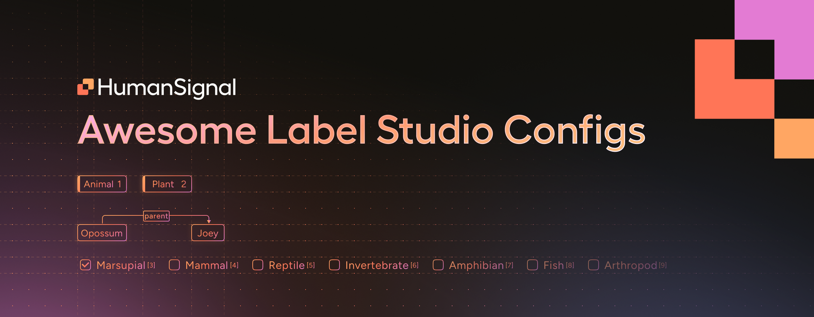

[](https://slack.labelstud.io/?source=github-2)

<button Join the Discourse Forum>



# Awesome Label Studio Configs

A community-driven collection of Label Studio configs for various data annotation tasks—from bounding boxes and segmentation to text classification and more. Quickly find, test, and share configurations to accelerate your labeling workflow.

## 🚀 Get Started

You can quickly test these configs in two ways:

### Option 1: Label Studio Playground

1. Visit the [Label Studio Playground](https://labelstud.io/playground/);

2. Paste any config (XML or JSON) into the Labeling Config section.

### Option 2: Run Locally

1. [Install Label Studio](https://labelstud.io/guide/install);

2. [Start Label Studio](https://labelstud.io/guide/start);

3. [Create a new project](https://labelstud.io/guide/setup_project);

4. Paste any config (XML or JSON) into the [Labeling Interface](https://labelstud.io/guide/setup).

### Option 3: Run on the Label Studio Cloud

1. [Start your Free Trial](https://app.humansignal.com/user/cloud-trial?offer=d9a5) or [login into your account](https://app.humansignal.com/user/login/);

2. [Create a new project](https://docs.humansignal.com/guide/setup_project);

3. Paste any config (XML or JSON) into the [Labeling Interface](https://docs.humansignal.com/guide/setup).

### 🤝 How to Contribute

We welcome community contributions! Share your configs and help others annotate faster and better:

1. Fork this repository;

2. Create a new directory under `label-configs/` for your task (e.g., `label-configs/my-awesome-audio-classification/`);

3. Add the following:

- Label config file (.xml or .json);

- Sample data file (.json) demonstrating the config;

- A brief README.md explaining your config;

- A `preview/` folder with screenshots or GIFs;

- A `manifest.json` with metadata about your config;

4. Validate your config (required once):

```bash
pip install pre-commit check-jsonschema
pre-commit install --hook-type pre-push
```

5. Submit a Pull Request with a clear description.

For more details, see CONTRIBUTING.md.

## 💡 Why This Project?

- **Speed up your workflow**: Quickly access ready-to-use configs to quickly get started.

- **Learn from examples**: Explore community best practices and get access to adavanced layouts to improve the quality of your labeling workflow. 

- **Collaborate & Innovate**: Share your own configurations or improve an existing one to help others. Connect with contributors to learn more about their labeling configs and data labeling best practices.

We believe that by collectively pooling our knowledge, everyone benefits—from new learners to advanced users.

## 📚 Extra Resources

- **Official Docs**: [Label Studio Documentation](https://labelstud.io)
- **GitHub Repo**: [Label Studio on GitHub](https://github.com/HumanSignal/label-studio/)
- **Community**: Check out Slack or Discord channels mentioned in the official docs.

## 🙏 Acknowledgments

Special thanks to all contributors! Together, we're creating the most comprehensive, user-friendly collection of data labeling configurations.

Happy Labeling!

## 📜 License

This software is licensed under the [Apache 2.0 LICENSE](/LICENSE) © [HumanSignal](https://humansignal.com/). 2020-2025