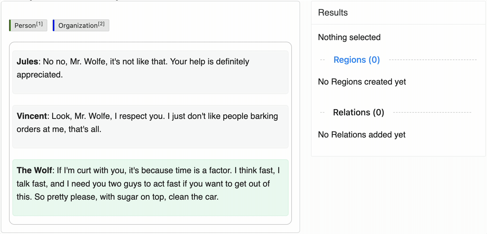

# HTML NER Tagging

This labeling config uses **HyperText** elements for named entity recognition on HTML content. 
It highlights recognized entities (Person, Organization) within styled HTML text.

---

## Preview

---

## Author & Contributors

- **Author**: [@luarmr](https://github.com/luarmr)
- **Contributors**:
  - [@another-contributor](https://github.com/another-contributor)

---

## Special Instructions

- **HyperText**: This config uses the HyperText tool to display and label HTML. 
- **Labels**: Currently includes "Person" (green) and "Organization" (blue).

## More Info

For general usage and installation instructions, see the main 
[README](../../README.md) of this repository. 
If you have any feedback or suggestions, open a PR or issue on GitHub!
