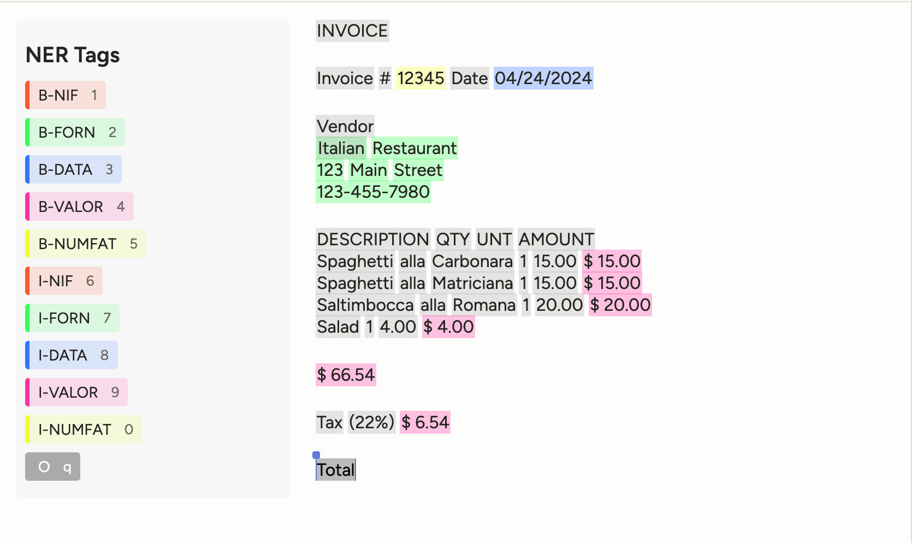

# NER Tagging for Invoices (BIO Format)

This labeling config enables Named Entity Recognition (NER) on invoice documents using the BIO (Beginning, Inside, Outside) format. If you are handling images of invoices, you must first run the [OCR of Invoices for NER Tagging with BIO Format](../ocr-invoices-pre-ner-bio-format/) configuration to extract and verify the OCR text before proceeding with NER tagging.

---

## Preview

---

## Author & Contributors

- **Author**: [@meditas](https://community.labelstud.io/u/meditas/summary)
- **Contributors**:
  - [@redeipirati](https://github.com/redeipirati)
  - [@carly-bartel](https://github.com/carly-bartel)

---

## Special Instructions

- **Text**:  Text showing the recognized text from the invoice.
- **BIO Format Labels**: 
  - B- prefix: Beginning of an entity
  - I- prefix: Inside/continuation of an entity
  - O: Outside/not part of any entity
- **Entity Types**:
  - NIF: Tax identification number
  - FORN: Supplier information
  - DATA: Date information
  - VALOR: Amount/Value
  - NUMFAT: Invoice number

### Handling Images of invoices? Run the OCR task first

Before using this configuration, you need to preprocess your invoice images with an OCR model like this: [OCR of Invoices for NER Tagging with BIO Format](../ocr-invoices-pre-ner-bio-format/).

## More Info

For general usage and installation instructions, see the main
[README](../../README.md) of this repository.
If you have any feedback or suggestions, open a PR or issue on GitHub! 