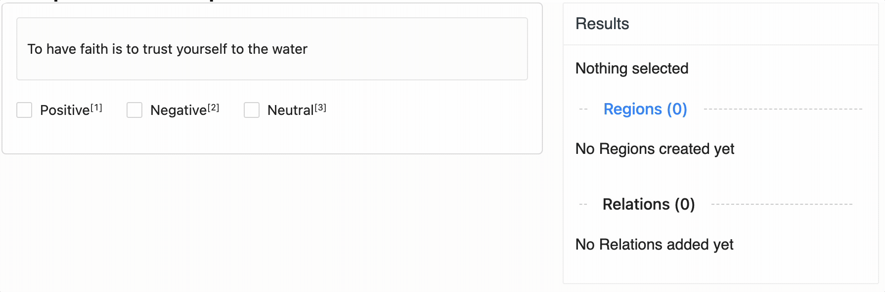

# Two-Level Text Classification

This labeling config lets you assign a **sentiment** (Positive, Negative, or Neutral) to a piece of text. 
After picking a sentiment, a second-level classification appears to categorize the text as *Descriptive* or *Emotional*.

---

## Preview




---

## Author & Contributors

- **Author**: [@luarmr](https://github.com/luarmr)
- **Contributors**:
  - [@bmartel](https://github.com/bmartel)


---

## Special Instructions

- **Conditional Choices**: The second set of choices (other-props) only appears after selecting a sentiment. This is done with:
```xml
visibleWhen="choice-selected"
whenTagName="sentiment"
```
---

## More Info

For general usage and installation instructions, see the main 
[README](../../README.md) of this repository. 
If you have any feedback or suggestions, open a PR or issue on GitHub!

